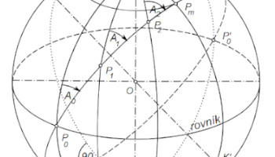
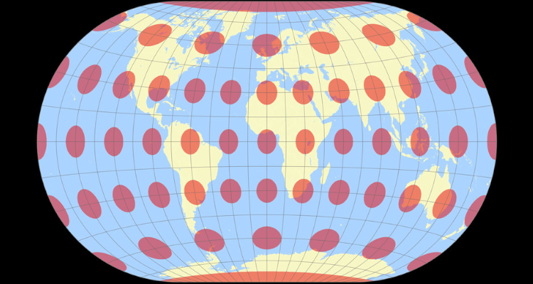

# Kartografie 1 {: .page_title}

Význam __matematické kartografie__. Referenční plochy a souřadnicové soustavy. Kartografická zkreslení. __Klasifikace kartografických zobrazení__. Zobrazení elipsoidu na kouli. Jednoduchá zobrazení kuželová, válcová a azimutální. Nepravá, polykónická, polyedrická a obecná zobrazení. Přehled zobrazení užitých na území ČR a ve světě. Volba, identifikace a hodnocení zobrazení. Referenční __souřadnicové systémy__ v GIS. 

<h2 style="text-align:center;">Naučíte se</h2>
<!-- styl je zde pridany HTML tagem (ne pomoci '##'), aby se text neobjevil v tabulce obsahu vlevo na strance -->

 <!-- specificky format gridu (trida "grid_icon_info") na miru uvodni strance predmetu -->

-   :material-map-outline:{ .xl }

    pochopit význam __matematické kartografie__

-   :material-vector-polygon:{ .xl }

    definovat  __referenční systémy__ v GIS

-   :octicons-globe-16:{ .xl }

    rozeznávat __kartografická zobrazení__ a pracovat s nimi

-   :material-tools:{ .xl }

    vypočítat kartografické __zkreslení__

{: .no-filter }
{: .no-filter }
{: .no-filter }
{: .no-filter }
{: .no-filter }
{: .no-filter }
{: .no-filter }

## Doporučená literatura

- Buchar P.: Matematická kartografie (skriptum)
- Fiala F.: Matematická kartografie (učebnice)
- Hojovec a kol.: Kartografie (učebnice)

## Přednášky {: style="margin-bottom:0;"}

účast doporučená
{: style="opacity:50%;margin-top:0;"}

__[prof. Ing. Jiří Cajthaml, Ph.D.](https://geomatics.fsv.cvut.cz/employees/jiri-cajthaml/)__

1. [Význam matematické kartografie. Referenční plochy. Souřadnicové soustavy. Důležité křivky.](http://maps.fsv.cvut.cz/~cajthaml/vyuka/kar1/prednasky/KAR1_pr1.pdf)
2. [Kartografická zobrazení. Délkové zkreslení. Podmínky konformity. Zkreslení azimutu a úhlu. Hlavní paprsky. Plošné zkreslení. Zkreslení při známých hlavních paprscích.](http://maps.fsv.cvut.cz/~cajthaml/vyuka/kar1/prednasky/KAR1_pr2.pdf)
3. [Klasifikace zobrazení. Jednoduchá zobrazení. Zobrazení elipsoidu na kouli.](http://maps.fsv.cvut.cz/~cajthaml/vyuka/kar1/prednasky/KAR1_pr3.pdf)
4. [Kuželová zobrazení ekvidistantní, ekvivalentní, konformní.](http://maps.fsv.cvut.cz/~cajthaml/vyuka/kar1/prednasky/KAR1_pr4.pdf)
5. [Válcová zobrazení ekvidistantní, ekvivalentní, konformní. Válcové projekce. Azimutální zobrazení. Azimutální projekce.](http://maps.fsv.cvut.cz/~cajthaml/vyuka/kar1/prednasky/KAR1_pr5.pdf)
6. [Zobrazení použitá na území ČR. Cassiniho zobrazení. Křovákovo zobrazení.](http://maps.fsv.cvut.cz/~cajthaml/vyuka/kar1/prednasky/KAR1_pr6.pdf)
7. [Zobrazení použitá na území ČR. Gaussovo zobrazení elipsoidu v poledníkových pásech. Zobrazení UTM.](http://maps.fsv.cvut.cz/~cajthaml/vyuka/kar1/prednasky/KAR1_pr7.pdf)
8. [Nepravá zobrazení kuželová, azimutální a válcová. Jejich modifikace.](http://maps.fsv.cvut.cz/~cajthaml/vyuka/kar1/prednasky/KAR1_pr8.pdf)
9. [Polykónická zobrazení. Neklasifikovaná zobrazení. Polyedrické aplikace.](http://maps.fsv.cvut.cz/~cajthaml/vyuka/kar1/prednasky/KAR1_pr9.pdf)
10. [Volba, užití a identifikace zobrazení. Hodnocení zobrazení. Kritéria pro optimalizaci zobrazení. ](http://maps.fsv.cvut.cz/~cajthaml/vyuka/kar1/prednasky/KAR1_pr10.pdf)
11. [Referenční souřadnicové systémy v GIS. Systém JTSK/05. Přehled v praxi užívaných zobrazení. Transformace rovinných souřadnic.](http://maps.fsv.cvut.cz/~cajthaml/vyuka/kar1/prednasky/KAR1_pr11.pdf)

## Cvičení {: style="margin-bottom:0;"}

__[prof. Ing. Jiří Cajthaml, Ph.D.](https://geomatics.fsv.cvut.cz/employees/jiri-cajthaml/)__

| Datum  | Náplň cvičení |
|--------|--------------|
| 20.2.  | odpadá       |
| 27.2.  | odpadá       |
| 6.3.   | zadání [__1. úlohy__](./ulohy/uloha1.md) |
| 13.3.  | konzultace   |
| 20.3.  | zadání [__2. úlohy__](./ulohy/uloha2.md) |
| 27.3.  | konzultace   |
| 3.4.   | zadání [__3. úlohy__](./ulohy/uloha3.md) |
| 10.4.  | test z úloh 1+2 |
| 17.4.  | Velikonoce   |
| 24.4.  | zadání [__4. úlohy__](./ulohy/uloha4.md) |
| 29.4.  | úterý (čtvrteční rozvrh) - konzultace |
| 1.5.   | svátek       |
| 8.5.   | svátek       |
| 15.5.  | výuka v terénu |
| 19.5.  | pondělí (čtvrteční rozvrh) výuka v terénu |
| x.5.   | test z úloh 3+4 |

__Každá úloha bude obsahovat:__

- zadání
- matematickou formulaci
- výpočty včetně potřebných mezivýpočtů
- zdrojové kódy skriptů
- obrazové přílohy
- přehledný souhrn výsledků v tabulkách
- zhodnocení výsledků a závěr

Úlohy nesprávně numericky vyřešené či nedbale vyhotovené nebudou přijaty. Úlohy 1+2, 3+4 se po ukončení testují. Pro udělení zápočtu je nezbytně nutné odevzdání všech úloh a úspěšné vykonání požadovaných testů.

Literatura je uvedená v harmonogramu přednášek. 

---

[Stránka předmětu v :custom-kos-logo-img-BW:{.middle style="margin-left:3px;"} :custom-kos-logo-BW:{.xl .middle}](https://kos.cvut.cz/course-syllabus/155KAR1){ .md-button .md-button--primary target="_blank"}
{align=center}

 
